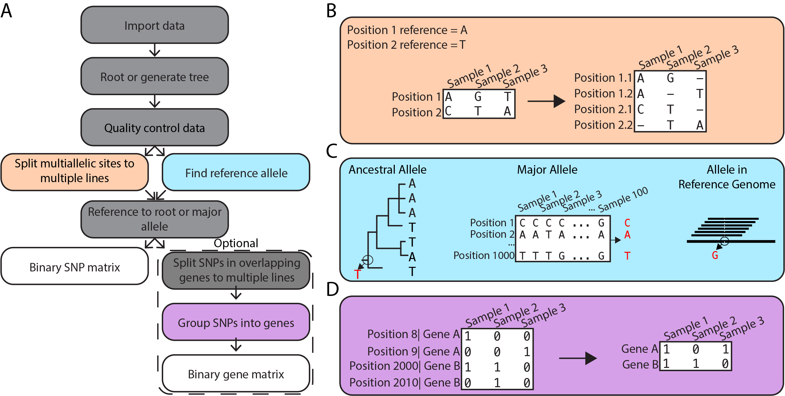
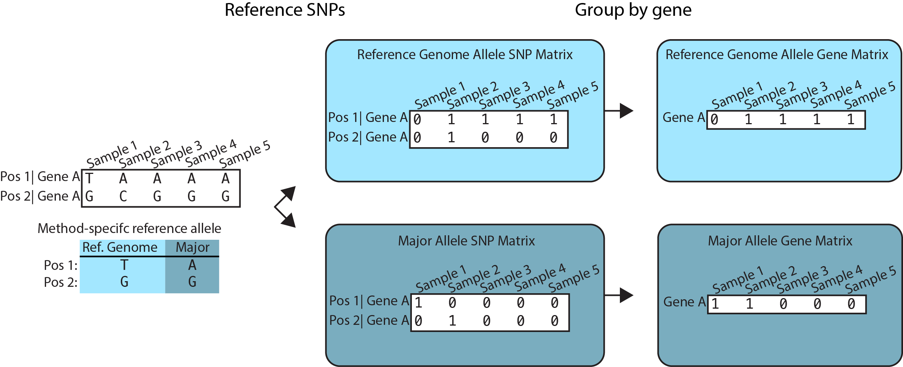
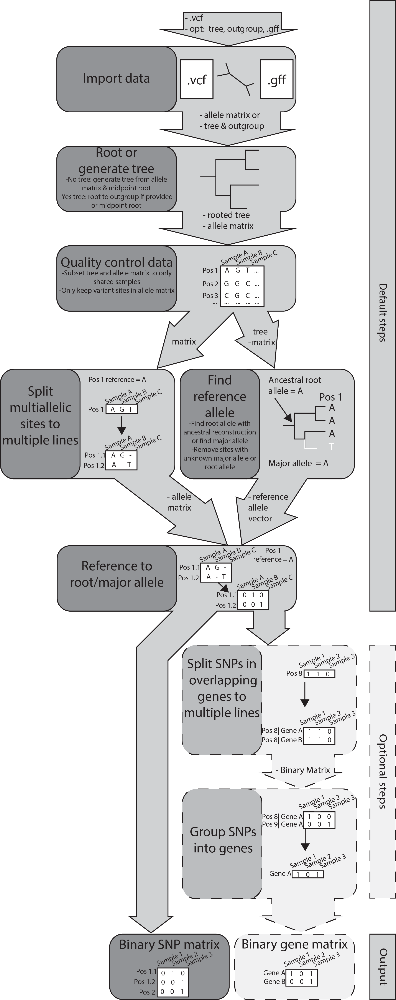

```{r, include = FALSE}
knitr::opts_chunk$set(
  collapse = TRUE,
  comment = "#>"
)
```

## Introduction to prewas 
prewas is a tool to standardize the pre-processing of your genomic data before performing a bacterial genome-wide association study (bGWAS). 

prewas creates a variant matrix (where each row is a variant, each column is a sample, and the entries are presence - 1 - or absence - 0 - of the variant) that can be used as input for bGWAS tools, such as [hogwash](https://github.com/katiesaund/hogwash) or [treeWAS](https://github.com/caitiecollins/treeWAS).  

When creating the binary variant matrix, prewas can perform 3 pre-processing steps including: 

1. dealing with  multiallelic SNPs,

1. (optional) dealing with SNPs in overlapping genes, and 

1. choosing a reference allele. 

These 3 steps in the prewas workflow are shown below. (B) shows how prewas handles multialleleic sites, (C) shows options for choosing a reference allele and (D) shows how prewas can group SNPs into genes. A detailed workflow indicating required file inputs can be seen below in the "Detailed prewas workflow" section. 

{width=70%}

### 1. Dealing with multiallelic SNPs
A multiallelic site is a site with more than two alleles present at a locus. Most bGWAS methods require a binary input (variant presence or absence) - so multiallelic sites don't fit into this mold. 

One could consider the reference allele 0 and any alternative allele as 1. However, each alternative allele could confer a different functional impact on the expressed protein. Thus, lumping the alternative alleles into one category will take away the ability to study these functional differences.  

prewas uses the multi-line format to represent mutliallelic SNPs. Below are examples of how a triallelic site (T, A, and G) can be represented in a single line of a variant matrix compared to multiple lines of a variant matrix. 

#### Single-line format: 

1. T -> A, G 

#### Multi-line format: 

1. T->A 

1. T->G

### 2. Dealing with SNPs in overlapping genes 

A SNP in an overlapping gene could have a different impact on those two genes. Therefore, when a gff is provided, prewas will output a binary variant matrix where a SNP in `x` overlapping genes will be represented on `x` lines. When a gff is provided, prewas will also output a gene-based variant matrix indicating presence or absence of at least 1 variant in that gene, and  SNPs in overlapping genes will be assigned to both genes.    

### 3. Choosing a reference allele 
A reference allele, the allele that will be denoted 0 in a binary matrix could be: 

1. the allele in a reference genome 
1. the major allele at each position 
1. the ancestral allele at each position 

Choosing a reference allele can be particularly important when doing gene-based analysis and therefore aggregating SNPs by gene. We suggest referencing to the ancestral allele for evolutionary interpretability. In cases where ancestral reconstruction is not feasible (e.g. computational intensity) or low confidence, we suggest referencing to the major allele instead of referencing to an arbitrary reference genome because using the major allele leads to less masking of variation at the gene level. 

{width=70%}

When ancestral reconstruction is not used (`anc = FALSE`), prewas will use the major allele as the reference allele. 

## Outputs: 
prewas can output matrices for use with both SNP-based bGWAS and gene-based bGWAS. 

## Usage 
At minimum, prewas requires a .vcf, but can also take in a phylogenetic tree, the name of the outgroup in that tree (if any), and a .gff for use with gene-based analysis. 

Below, we'll explore some usage examples using toy data built into the package. 

```{r setup}
library(prewas)
vcf = prewas::vcf
gff = prewas::gff
tree = prewas::tree
outgroup = prewas::outgroup
```

### Minimal prewas run: 

#### Inputs: 

1. required vcf file

#### Specifications: 

* No ancestral reconstruction 

```{r minimal_prewas_run, warning = FALSE}
results_minimal = prewas(dna = vcf, 
                         anc = FALSE)
```

#### Will output a list containing: 

* `allele_mat`: An allele matrix, created from the vcf where each multiallelic site will be on its own line. The rowname will be the position of the variant in the vcf file. If the position is triallelic, there will be two rows containing the same information. The rows will be labeled "pos" and "pos.1". If the position is quadallelic, there will be three rows containing the same information. The rows will be labeled "pos", "pos.1", and "pos.2".

* `bin_mat`: A binary matrix, the same dimensions as the allele matrix and with corresponding row names, where 0 is the reference allele and 1 indicates a variant. The reference allele is the major allele (because `anc = FALSE`). 

* `ar_results`: Will indicate the allele used as the reference allele (in this case, the major allele). The number of rows is the length of the number of rows of `bin_mat`. 

* `dup`: An index that identifies duplicated rows. If the index is unique (appears once), that means it is not a multiallelic site. If the index appears more than once, that means the row was replicated `x` times, where `x` is the number of alternative alleles.  

```{r}
table(results_minimal$dup)
```


* `gene_mat`: `NULL`; Because no information is provided about genes (that is, a gff file), there will be no gene matrix generated. This also means variants that appear in more than 1 overlapping gene will not be split into multiple lines. 

* `tree`: `NULL`; Because ancestral reconstruction is not needed no tree was generated.   

### Maximal prewas run: 

#### Inputs: 

1. required vcf file
1. tree
1. string of the outgroup
1. gff file 

#### Specifications: 

* Conduct ancestral reconstruction 


```{r maximal_prewas_run, warning = FALSE}
results_maximal = prewas(dna = vcf, 
                         tree = tree, 
                         outgroup = outgroup, 
                         gff = gff,
                         anc = TRUE)
```

#### Will output: 

* `allele_mat`: Nearly identical to results_minimal, but now with the column corresponding to the outgroup removed.

```{r}
dim(results_maximal$allele_mat)
```

```{r}
head(results_maximal$allele_mat,10)
```

* `bin_mat`: A binary matrix, where 0 is the reference allele and 1 indicates a variant. The reference allele is the ancestral allele (because `anc = TRUE`). The dimensions do not match the `allele_mat`, because SNPs in overlapping genes are represented on multiple lines. Position and locus tag name is provided in the rowname. Again, the column corresponding to the outgroup is removed.

```{r}
dim(results_maximal$bin_mat)
```

```{r}
head(results_maximal$allele_mat)
```


```{r}
head(results_maximal$bin_mat, 10)
```

* `ar_results`: Will indicate the allele used as the reference allele (in this case, the ancestral allele). Because ancestral reconstruction was used, the probability of the ancestral alleles is also reported. The number of rows is the same as the number of rows of `allele_mat`.  

```{r}
head(results_maximal$ar_results)
```

* `dup`: same as `results_minimal`. Mutiple indices indicates multiallelic site split, not overlapping genes split. 


* `gene_mat`: Because a gff file was provided, a gene matrix is generated. Each row is a gene, not a SNP. 

```{r}
head(results_maximal$gene_mat)
```

* `tree`: Returns the phylo object that was provided after it has been rooted to the provided outgroup and the outgroup was removed.

```{r}
results_maximal$tree
```

### No tree? 

If you do not have a tree, a neighbor-joining tree will be generated and ancestral reconstruction can be conducted. We recommend using more sophisticated methods for tree building (e.g. maximum likelihood or Bayesian methods) but for an initial analysis, we have provided the option to create a neighbor-joining tree. 

```{r results_no_tree, warning = FALSE}
results_no_tree = prewas(dna = vcf, 
                         gff = gff,
                         anc = TRUE)
```

`results_no_tree` returns similar results to `results_maximal` but with one critical difference in the `tree` object:
`tree`: this phylogenetic tree was built so that ancestral reconstruction could be performed for the variant referencing step. Note that this tree has one more tip than `results_maximal$tree` because an outgroup was provided with `results_maximal` which was dropped after being used to root that tree. For `results_no_tree` the generated tree was midpoint rooted & no outgroup was provided so no tips were dropped.

```{r}
results_no_tree$tree
```


## Detailed prewas workflow

A detailed visualization of the prewas workflow is shown below. 

{width=50%}


